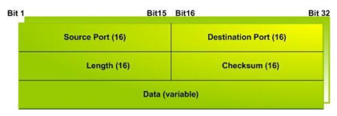
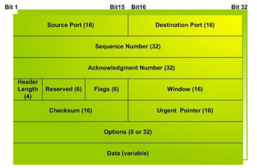
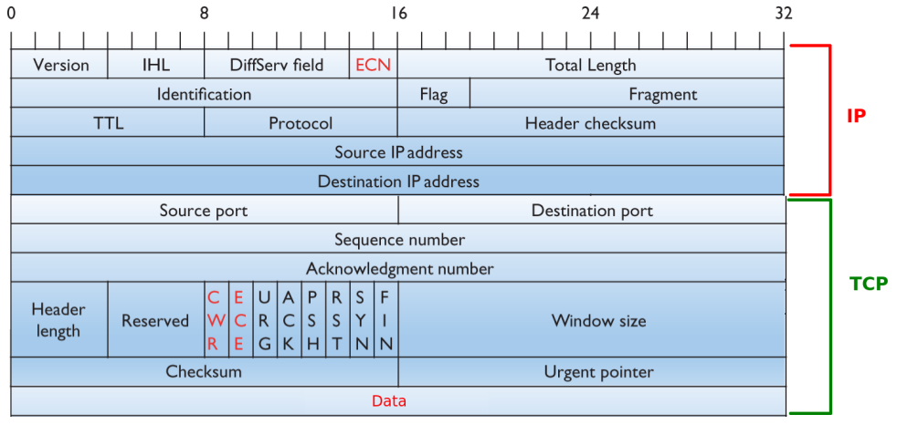

1. Napisz program, który z serwera ntp.task.gda.pl pobierze aktualną datę i czas, a następnie wyświetli je na konsoli. Serwer działa na porcie 13.

---

2. Napisz program klienta, który połączy się z serwerem TCP działającym pod adresem 212.182.24.27 na porcie 2900, a następnie wyśle do niego wiadomość i odbierze odpowiedź.

---

3. Napisz program klienta, który połączy się z serwerem TCP działającym pod adresem 212.182.24.27 na porcie 2900, a następnie będzie w pętli wysyłał do niego tekst wczytany od użytkownika, i odbierał odpowiedzi.

---

4. Napisz program klienta, który połączy się z serwerem UDP działającym pod adresem 212.182.24.27 na porcie 2901, a następnie wyśle do niego wiadomość i odbierze odpowiedź.

---

5. Napisz program klienta, który połączy się z serwerem UDP działającym pod adresem 212.182.24.27 na porcie 2901, a następnie będzie w pętli wysyłał do niego tekst wczytany od użytkownika, i odbierał odpowiedzi.

---

6. Napisz program klienta, który połączy się z serwerem UDP działającym pod adresem 212.182.24.27 na porcie 2902, a następnie prześle do serwera liczbę, operator, liczbę (pobrane od użytkownika) i odbierze odpowiedź.

---

7. Zmodyfikuj program numer 6 z laboratorium nr 1 w ten sposób, aby oprócz wyświetlania informacji o tym, czy port jest zamknięty, czy otwarty, klient wyświetlał również informację o tym, jaka usługa jest uruchomiona na danym porcie.

---

8. Zmodyfikuj program numer 7 z laboratorium nr 1 w ten sposób, aby oprócz wyświetlania informacji o tym, czy porty są jest zamknięte, czy otwarte, klient wyświetlał również informację o tym, jaka usługa jest uruchomiona na danym porcie.

---

9. Napisz program klienta, który połączy się z serwerem UDP działającym pod adresem 212.182.24.27 na porcie 2906, a następnie prześle do serwera adres IP, i odbierze odpowiadającą mu nazwę hostname.

---

10. Napisz program klienta, który połączy się z serwerem UDP działającym pod adresem 212.182.24.27 na porcie 2907, a następnie prześle do serwera nazwę hostname, i odbierze odpowiadający mu adres IP.

---

11. Zmodyfikuj program nr 2 z laboratorium nr 2 w ten sposób, aby klient wysłał i odebrał od serwera wiadomość o maksymalnej długości 20 znaków. Serwer TCP odbierający i wysyłający wiadomości o długości 20 działa pod adresem 212.182.24.27 na porcie 2908. Uwzględnij sytuacje, gdy:
- wiadomość do wysłania jest za krótka - ma być wówczas uzupełniania do 20 znaków znakami spacji
- wiadomość do wysłania jest za długa - ma być przycięta do 20 znaków (lub wysłana w całości - sprawdź, co się wówczas stanie)

---

12. Funkcje recv i send nie gwarantują wysłania / odbioru wszystkich danych. Rozważmy funkcję recv. Przykładowo, 100 bajtów może zostać wysłane jako grupa po 10 bajtów, albo od razu w całości. Oznacza to, iż jeśli używamy gniazd TCP, musimy odbierać dane, dopóki nie mamy pewności, że odebraliśmy odpowiednią ich ilość. Zmodyfikuj program nr 11 z laboratorium nr 2 w ten sposób, aby mieć pewność, że klient w rzeczywistości odebrał / wysłał wiadomość o wymaganej długości.

---

13. Poniżej znajduje się pełny zapis datagramu UDP w postaci szesnastkowej.

```
ed 74 0b 55 00 24 ef fd 70 72 6f 67 72 61
6d 6d 69 6e 67 20 69 6e 20 70 79 74 68 6f
6e 20 69 73 20 66 75 6e
```

Wiedząc, że w zapisie szesnastkowym jedna cyfra reprezentuje 4 bity, oraz znając strukturę datagramu
UDP:



Napisz program, który z powyższego datagramu UDP wydobędzie:

- numer źródłowego portu
- numer docelowego portu
- dane (ile bajtów w tym pakiecie zajmują dane?)

A następnie uzyskany wynik w postaci:
> zad14odp;src;X;dst;Y;data;Z

gdzie:

- X to wydobyty z pakietu numer portu źródłowego
- Y to wydobyty z pakietu numer portu docelowego
- Z to wydobyte z pakietu dane

prześle do serwera UDP działającego na porcie numer 2910 pod adresem 212.182.24.27 w celu sprawdzenia, czy udało się prawidłowo odczytać wymagane pola. Serwer zwróci odpowiedź TAK lub NIE, a w przypadku błędnego sformatowania wiadomości, odeśle odpowiedź BAD SYNTAX.

```python
import socket

hex_data = (
    "ed 74 0b 55 00 24 ef fd 70 72 6f 67 72 61 "
    "6d 6d 69 6e 67 20 69 6e 20 70 79 74 68 6f "
    "6e 20 69 73 20 66 75 6e"
)

bajty = bytes.fromhex(hex_data)

port_zrodlowy = int.from_bytes(bajty[0:2], byteorder="big")
port_docelowy = int.from_bytes(bajty[2:4], byteorder="big")
dlugosc_udp = int.from_bytes(bajty[4:6], byteorder="big")
dlugosc_danych = dlugosc_udp - 8

wiadomosc = f"zad13odp;src;{port_zrodlowy};dst;{port_docelowy};data;{dlugosc_danych}"
print(wiadomosc)

sock = socket.socket(socket.AF_INET, socket.SOCK_DGRAM)
sock.connect(("212.182.24.27", 2910))
# sock.connect(("127.0.0.1", 2910))

sock.send(wiadomosc.encode())
odpowiedz = sock.recv(1024)

print("Odpowiedź serwera:", odpowiedz.decode())
sock.close()
```

---

14. Poniżej znajduje się pełny zapis segmentu TCP w postaci szesnastkowej (pole opcji ma 12 bajtów).

```
0b 54 89 8b 1f 9a 18 ec bb b1 64 f2 80 18
00 e3 67 71 00 00 01 01 08 0a 02 c1 a4 ee
00 1a 4c ee 68 65 6c 6c 6f 20 3a 29
```

Wiedząc, że w zapisie szesnastkowym jedna cyfra reprezentuje 4 bity, oraz znając strukturę segmentu TCP:



Napisz program, który z powyższego segmentu TCP wydobędzie:

- numer źródłowego portu
- numer docelowego portu
- dane (ile bajtów w tym pakiecie zajmują dane?)

A następnie uzyskany wynik w postaci:
> zad13odp;src;X;dst;Y;data;Z
gdzie:

- X to wydobyty z pakietu numer portu źródłowego
- Y to wydobyty z pakietu numer portu docelowego
- Z to wydobyte z pakietu dane

prześle do serwera UDP działającego na porcie numer 2909 pod adresem 212.182.24.27 w celu sprawdzenia, czy udało się prawidłowo odczytać wymagane pola. Serwer zwróci odpowiedź TAK lub NIE, a w przypadku błędnego sformatowania wiadomości, odeśle odpowiedź BAD SYNTAX.

```python
import socket

hex_data = (
    "0b 54 89 8b 1f 9a 18 ec bb b1 64 f2 80 18 "
    "00 e3 67 71 00 00 01 01 08 0a 02 c1 a4 ee "
    "00 1a 4c ee 68 65 6c 6c 6f 20 3a 29"
)

bajty = bytes.fromhex(hex_data)

port_zrodlowy = int.from_bytes(bajty[0:2], byteorder="big")
port_docelowy = int.from_bytes(bajty[2:4], byteorder="big")

dlugosc_naglowka = (bajty[12] >> 4) * 4
dane = bajty[dlugosc_naglowka:].decode()

wiadomosc = f"zad14odp;src;{port_zrodlowy};dst;{port_docelowy};data;{dane}"
print(wiadomosc)

sock = socket.socket(socket.AF_INET, socket.SOCK_DGRAM)
sock.connect(("212.182.24.27", 2909))
# sock.connect(("127.0.0.1", 2910))

sock.send(wiadomosc.encode())
odpowiedz = sock.recv(1024)

print("Odpowiedź serwera:", odpowiedz.decode())
sock.close()
```

---

15. Poniżej znajduje się pełny zapis pakietu IP w postaci szesnastkowej (bez pola opcji IP, jeśli protokół to TCP, pole opcji TCP ma 12 bajtów).

```
45 00 00 4e f7 fa 40 00 38 06 9d 33 d4 b6 18 1b
c0 a8 00 02 0b 54 b9 a6 fb f9 3c 57 c1 0a 06 c1
80 18 00 e3 ce 9c 00 00 01 01 08 0a 03 a6 eb 01
00 0b f8 e5 6e 65 74 77 6f 72 6b 20 70 72 6f 67
72 61 6d 6d 69 6e 67 20 69 73 20 66 75 6e
```

Wiedząc, że w zapisie szesnastkowym jedna cyfra reprezentuje 4 bity, oraz znając strukturę pakietu IP (tu IP/TCP):



Napisz program, który z powyższego pakietu IP wydobędzie:

- wersję protokołu
- źródłowy adres IP
- docelowy adres IP
- typ protokołu warstwy wyższej:

    - Numer protokołu TCP w polu Protocol nagłówka IPv4 to 6 (0x06)
    - Numer protokołu UDP w polu Protocol nagłówka IPv4 to 17 (0x11)

Oraz, po określeniu typu protokołu (TCP/UDP) dodatkowo wydobędzie z pakietu:

- numer źródłowego portu
- numer docelowego portu
- dane (ile bajtów w tym pakiecie zajmują dane?)

Następnie, w celu sprawdzenia, czy udało się prawidłowo odczytać wymagane pola, wyśle do serwera UDP działającego na porcie numer 2911 pod adresem 212.182.24.27 dwie wiadomości. Serwer zwróci odpowiedź TAK lub NIE, a w przypadku błędnego sformatowania wiadomości, odeśle odpowiedź BAD SYNTAX.

Prawidłowy protokół powinien wyglądać w następujący sposób:

(a) Klient wysyła do serwera wiadomość w postaci:
> zad15odpA;ver;X;srcip;Y;dstip;Z;type;W

    gdzie:
    - X to wydobyty z pakietu numer wersji protokołu
    - Y to wydobyty z pakietu źródłowy adres IP
    - Z to wydobyty z pakietu docelowy adres IP
    - W to wydobyty z pakietu typ protokołu warstwy wyższej (numer)

(b) Klient odbiera od serwera wiadomość, która mówi o tym, czy odpowiedź jest prawidłowa, czy nie

(c) Jeśli klient otrzyma od serwera odpowiedź TAK, może wysłać kolejną wiadomość do sprawdzenia w postaci:
> zad15odpB;srcport;X;dstport;Y;data;Z

    gdzie:
    - X to wydobyty z pakietu numer portu źródłowego
    - Y to wydobyty z pakietu numer portu docelowego
    - Z to wydobyte z pakietu dane

(d) Klient odbiera od serwera wiadomość, która mówi o tym, czy odpowiedź jest prawidłowa, czy nie

```python
import socket

hex_data = (
    "45 00 00 4e f7 fa 40 00 38 06 9d 33 d4 b6 18 1b "
    "c0 a8 00 02 0b 54 b9 a6 fb f9 3c 57 c1 0a 06 c1 "
    "80 18 00 e3 ce 9c 00 00 01 01 08 0a 03 a6 eb 01 "
    "00 0b f8 e5 6e 65 74 77 6f 72 6b 20 70 72 6f 67 "
    "72 61 6d 6d 69 6e 67 20 69 73 20 66 75 6e"
)

bajty = bytes.fromhex(hex_data)

# --- IP ---
wersja = bajty[0] >> 4
ihl = (bajty[0] & 0x0F) * 4
total_length = int.from_bytes(bajty[2:4], byteorder="big")
typ_protokolu = bajty[9]

src_ip = ".".join(str(b) for b in bajty[12:16])
dst_ip = ".".join(str(b) for b in bajty[16:20])

# --- TCP ---
tcp_start = ihl
src_port = int.from_bytes(bajty[tcp_start:tcp_start+2], byteorder="big")
dst_port = int.from_bytes(bajty[tcp_start+2:tcp_start+4], byteorder="big")

tcp_header_length = (bajty[tcp_start+12] >> 4) * 4
data_start = tcp_start + tcp_header_length
data = bajty[data_start:total_length].decode()

msg_a = f"zad15odpA;ver;{wersja};srcip;{src_ip};dstip;{dst_ip};type;{typ_protokolu}"
msg_b = f"zad15odpB;srcport;{src_port};dstport;{dst_port};data;{data}"

print(msg_a)
print(msg_b)

sock = socket.socket(socket.AF_INET, socket.SOCK_DGRAM)
sock.connect(("212.182.24.27", 2911))
# sock.connect(("127.0.0.1", 2911))

sock.send(msg_a.encode())
odp_a = sock.recv(1024).decode()
print("Odpowiedź A:", odp_a)

if odp_a == "TAK":
    sock.send(msg_b.encode())
    odp_b = sock.recv(1024).decode()
    print("Odpowiedź B:", odp_b)

sock.close()
```

---

16. Po wykonaniu zadań 13 - 15, spróbuj jeszcze raz uruchomić klientów, wykorzystując dane zawarte w
pakietach. Jednocześnie za pomocą Wiresharka podsłuchuj pakiety i podejrzyj ich zawartość.